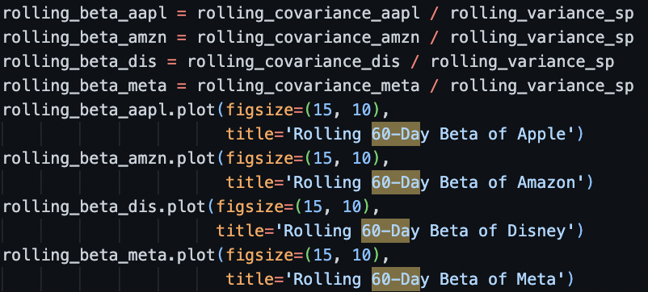
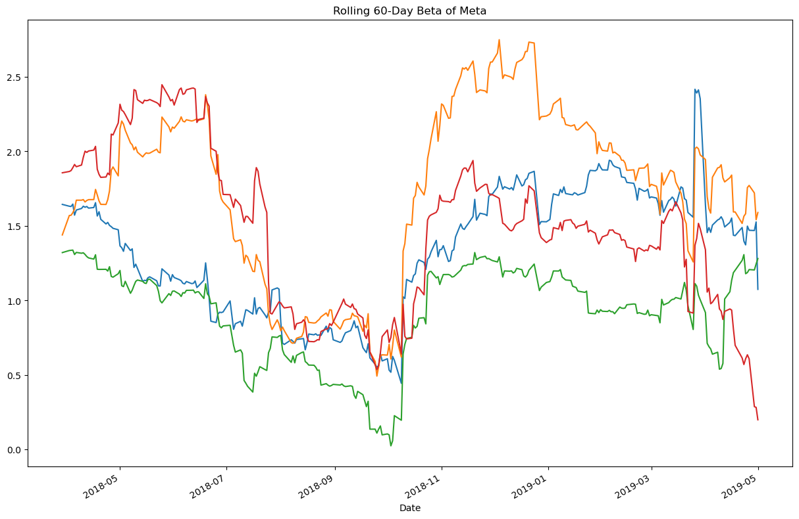

# Pandas-Homework

## The file whalereturns.py analyzes and plots all required data and is organized as well as commented as requested.
 

# Some Examples of code:

### Here is a code snippet which returns and plots the daily returns of all portfolios.

### Here is a code snippet which calculates the rolling betas for all 4 stocks in my portfolio by dividing the rolling covariance by the rolling variance.

### This is a plot of Meta's 60 day rolling beta
